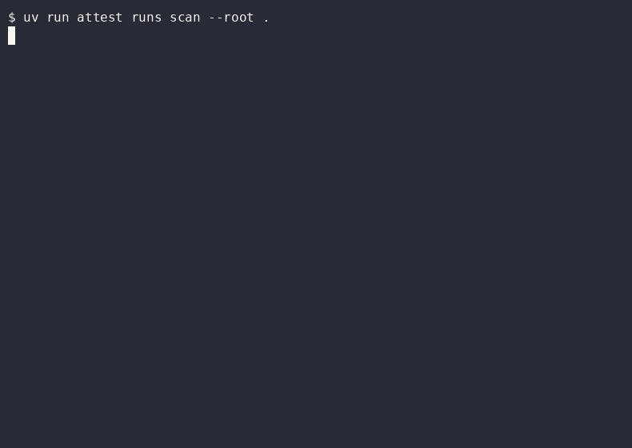
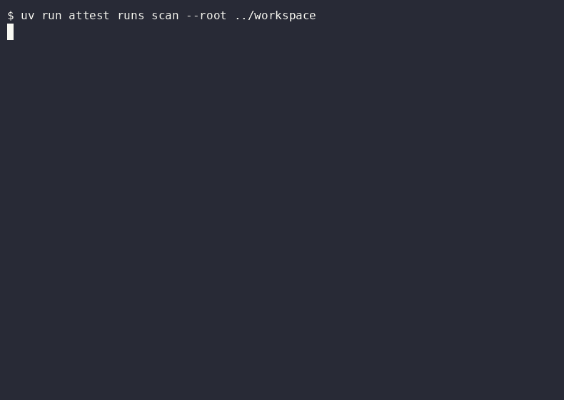
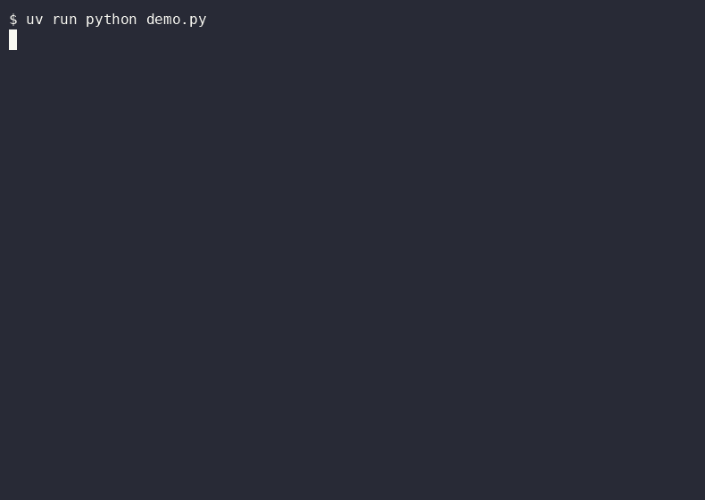
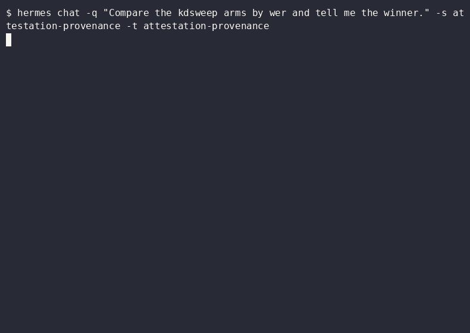
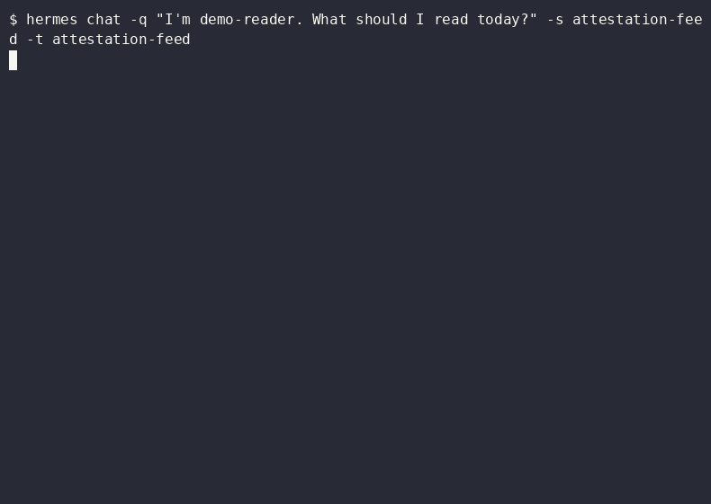

# Demo recordings

Six recording scripts under `demos/` capture `attest` in use — one per major
surface, plus two driving a real Hermes agent rather than calling the tools
directly. Every recording below is real output from a real run against the
fixtures in this repository; nothing is staged or re-typed.

## The run ledger and claim checker

`attest runs scan` reads experiment artifacts off disk, `runs compare` ranks
the arms of a sweep and says what it cannot conclude, and `attest claims`
checks every number in a draft against the run that produced it — one
`contradicted`, one `unsupported`, and a coverage lint for numbers no claim
covers. No model, no network.



## Citations

`attest claims` with `cite=` keys, then the `cite.*` tools over MCP: the lint
reports a key no configured source resolves, and says plainly that this is
about keys, not about whether the numbers are right.



## The reading graph and symbolic math

`kg.*` over a graph derived from real tags — the concept vocabulary, central
topics, a path between two concepts and an honest "no path" — then `sym.*`
doing algebra exactly, including a rule-by-rule derivation.



## The feed web UI

`attest serve`'s HTMX page: a persona's ranked feed, marking one item useful
and one not, and the caveat line changing as the ranking learns.

<!-- Raw HTML, so mkdocs does NOT rewrite this path the way it rewrites a
     Markdown link: the built page is guides/demos/index.html, two levels
     deep, so this needs ../../ where the images above are written ../ and
     rewritten. Getting it wrong yields a silently broken player, not a
     build error -- `mkdocs build --strict` passes either way. -->
<video src="../../media/feed.webm" controls muted playsinline width="100%">
  Your browser does not support the video tag —
  <a href="../../media/feed.webm">download the recording</a>.
</video>

## A real agent, not a script

The only two demos that drive an agent rather than calling tools directly.
Hermes answers a provenance question by calling `runs.ask`, and relays the
caveats rather than dropping them:



…and a feed question by calling `feed.ask`:



## What each one shows

| directory | shows | needs |
|---|---|---|
| `ledger/` | `attest runs scan`/`list`/`compare` and `attest claims` over `examples/workspace/` | nothing — pure local computation |
| `claims/` | `attest claims` plus `cite.*` over MCP, over `examples/citations/` | nothing — pure local computation |
| `kg-symbolic/` | `kg.*` and `sym.*` over MCP — neither has a CLI command or web page | a model server, once, to seed real tags |
| `feed/` | the HTMX web UI: a ranked feed, marking items useful, the onboarding form | a model server, to seed tagged items |
| `hermes/` (×2) | a real agent calling `runs.ask` and `feed.ask` over MCP | a live Hermes install and a model server |

Unlike `examples/*/`, these are not golden paths. They produce video rather
than a pinned output line, and most need a model, so
`tests/test_golden_paths.py` does not run them — which is also why they are
verified by hand rather than by CI.

## Running one

The two model-free demos need no setup:

```bash
bash demos/ledger/narrate.sh examples/workspace
bash demos/claims/narrate.sh examples/citations
```

`narrate.sh` is the inner script — it echoes and runs each command in turn.
`record.sh` wraps it in `asciinema` and converts the result with `agg`:

```bash
uv tool install asciinema
cargo install --locked --git https://github.com/asciinema/agg
bash demos/ledger/record.sh
```

The graph and feed demos need a seeded database first, because a graph built
from the offline stub's placeholder tags has nodes named `existing` and
`title` — not worth recording:

```bash
uv run python demos/kg-symbolic/seed_kg_db.py /tmp/demo.db   # needs a model
ATTEST_DB=/tmp/demo.db bash demos/kg-symbolic/record.sh
```

## Two things that look like bugs and are not

**`demos/kg-symbolic/demo.py` reads its database from `ATTEST_DB`, never from
a positional argument.** A path passed as an argument is silently ignored and
the demo runs against whatever `resolve_db_path` finds. Against a large real
database, `kg.communities` returns an alphabetical sprawl rather than the four
coherent clusters the seeded fixture gives — which reads as a clustering
defect and is an invocation mistake.

**The MCP server's INFO logs go to stderr.** Running `demo.py` by hand looks
noisy for that reason; `record.sh` already redirects them, so the recording
itself is clean.

## Output

Each `record.sh` / `record.py` writes to the repo-root `demo/` directory,
already gitignored, unless given a path as its first argument —
`feed/record.py` always writes `demo/feed.webm` and ignores that argument.
`demos/**/*.cast`, `*.gif`, `*.webm` and `*.db` are gitignored too, so a
recording made in place is never committed by accident.

## Last verified

All six ran green on 2026-09-22 against `main`, and none needed a code change.
`demos/README.md` carries the per-demo evidence.
