# Demo recordings

The recording scripts under `demos/` capture `attest` in use: one per major
surface, a real Hermes agent calling each of the four `*.ask` routers, and an
install on the hosting platform attestation ships through. Every recording
below is real output from a real run; nothing is staged or re-typed.

## The whole story, narrated

Four minutes, for experimental and computational scientists: installing on a
hosted agent, catching a wrong number in a draft, asking the agent, reading
the literature, and exact mathematics. Every clip is a real recording; the
voice is Piper, synthesized locally. `demos/film/build.py` rebuilds it from
`demos/film/scenes.toml`.

<video src="../../media/attestation-narrated.mp4" controls playsinline width="100%">
  <track kind="captions" src="../../media/attestation-narrated.vtt" srclang="en" label="English">
  <a href="../../media/attestation-narrated.mp4">Download the film</a>.
</video>

## Installing on a hosted agent

The Research Assistant starter on AgentMarkit, installed on the platform's own
template image the way its Worker does it: the starter package, then the
install script that clones and pins attestation, then every automated smoke
check. Recorded with `lab/scripts/rehearse_starter.sh` from the AgentMarkit
repository.

<!-- Raw HTML paths are ../../media/, not ../media/: see the feed video below. -->
<video src="../../media/agentmarkit-install.mp4" controls muted playsinline width="100%">
  <a href="../../media/agentmarkit-install.mp4">Download the recording</a>.
</video>

The same install with a model attached (gemma4:12b), a first ingest, and three
real questions. Two are answered from attestation. The third reaches `feed.ask`
but the model cut the question to a bare topic, and the router, which does not
guess, asks back:

<video src="../../media/agentmarkit-end-to-end.mp4" controls muted playsinline width="100%">
  <a href="../../media/agentmarkit-end-to-end.mp4">Download the recording</a>.
</video>

## The run ledger and claim checker

`attest runs scan` reads experiment artifacts off disk, `runs compare` ranks
the arms of a sweep and says what it cannot conclude, and `attest claims`
checks every number in a draft against the run that produced it — one
`contradicted`, one `unsupported`, and a coverage lint for numbers no claim
covers. No model, no network.

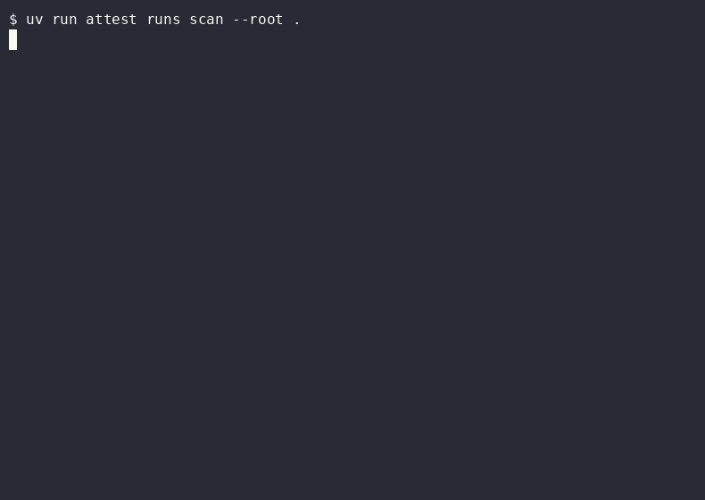

## A lab and a simulation

The ledger and the claim checker over an experimental project and a
computational one: a catalyst screen (yield, %) and a basis-set convergence
study (mean absolute error, kcal/mol). The draft carries one stale number, one
result from an experiment never run, one citation key no reference list holds,
and a catalyst loading nothing backs. The numbers are invented for the demo,
and `demos/science/workspace/FINDINGS.md` says so.

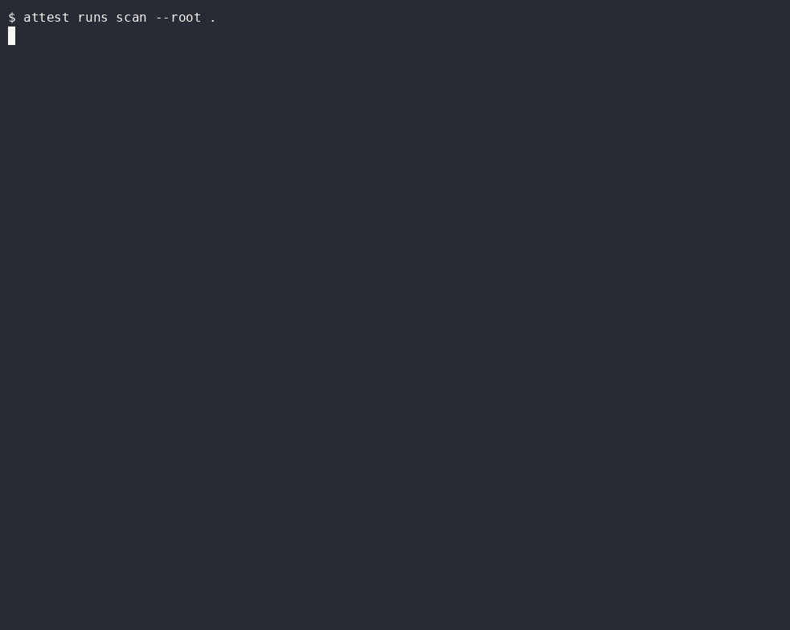

## Recording results

`attest runs record` for results that exist only in a lab notebook -- here
three annealing temperatures and a conductivity for each. It writes a result
and a config per arm in the shape `runs scan` reads, declares the metric's
direction, and with `--scan` compares the arms in the same call, caveats
included.

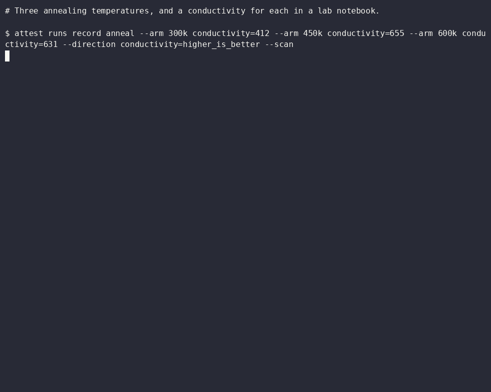

## Citations

`attest claims` with `cite=` keys, then the `cite.*` tools over MCP: the lint
reports a key no configured source resolves, and says plainly that this is
about keys, not about whether the numbers are right.

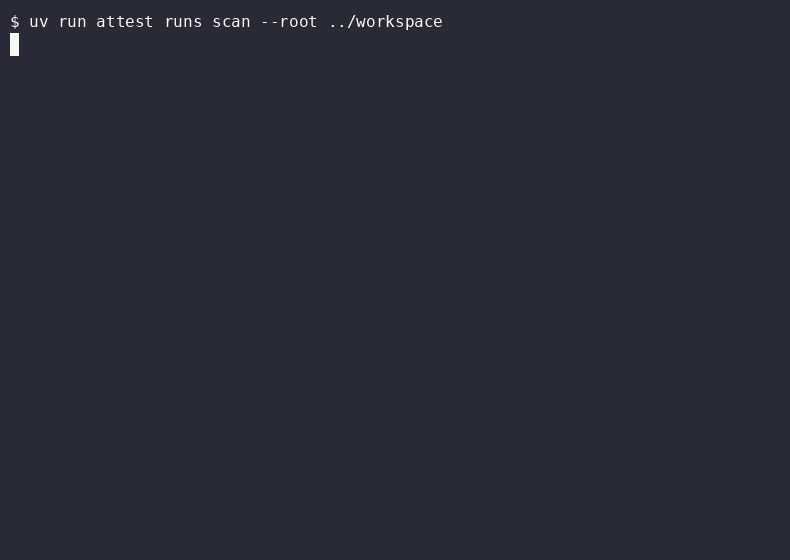

## The reading graph and symbolic math

`kg.*` over a graph derived from real tags — the concept vocabulary, central
topics, a path between two concepts and an honest "no path" — then `sym.*`
doing algebra exactly, including a rule-by-rule derivation.

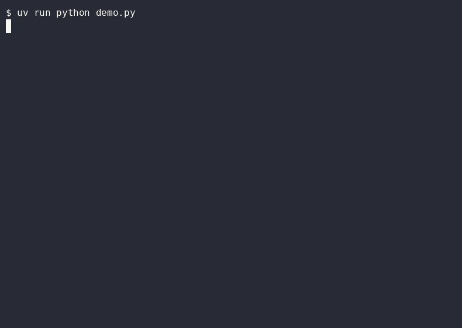

## The reference library

A BibTeX file synced into the deduplicated library, searched, one reference's
real citation list followed both ways (what it cites, what cites it, and which
of those are already in the library), and a filtered `.bib` written back out.
No model, no network.

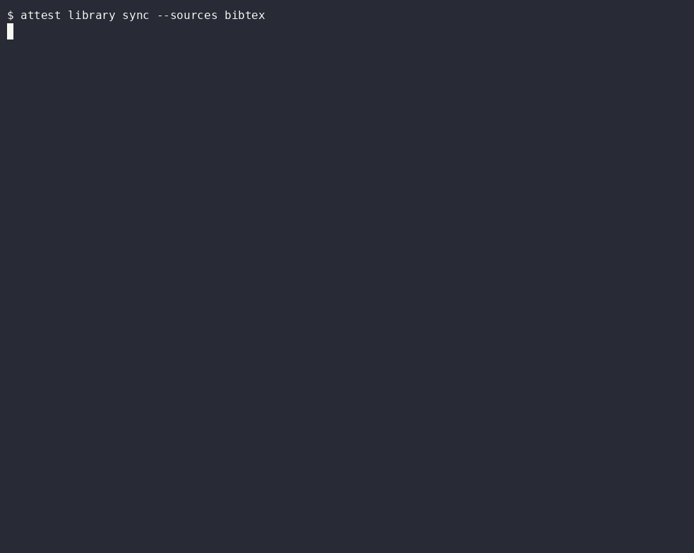

## Going out to look

`attest research` searches PubMed and CrossRef, keeps each hit in the
reference library under the source it came from (two versions of one preprint
merge into one reference), and `attest sources add` makes the same query a
standing topic that every ingest re-runs. Needs the network; arXiv is left
out here only because its export API throttles hard.

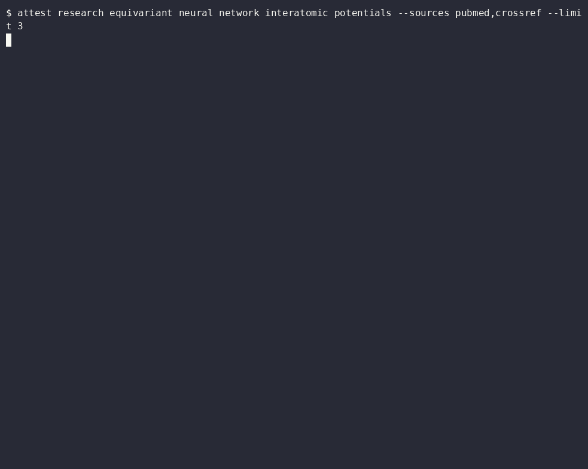

## The feed web UI

`attest serve`'s HTMX page: a persona's ranked feed, marking one item useful
and one not, and the caveat line changing as the ranking learns.

<!-- Raw HTML, so mkdocs does NOT rewrite this path the way it rewrites a
     Markdown link: the built page is guides/demos/index.html, two levels
     deep, so this needs ../../ where the images above are written ../ and
     rewritten. Getting it wrong yields a silently broken player, not a
     build error -- `mkdocs build --strict` passes either way. -->
<video src="../../media/feed.webm" controls muted playsinline width="100%">
  Your browser does not support the video tag —
  <a href="../../media/feed.webm">download the recording</a>.
</video>

## A real agent, not a script

These drive an agent rather than calling tools directly. Asked which basis
set did best, Hermes calls `runs.ask` and relays both caveats, including
"too close to call" (gemma4:12b):

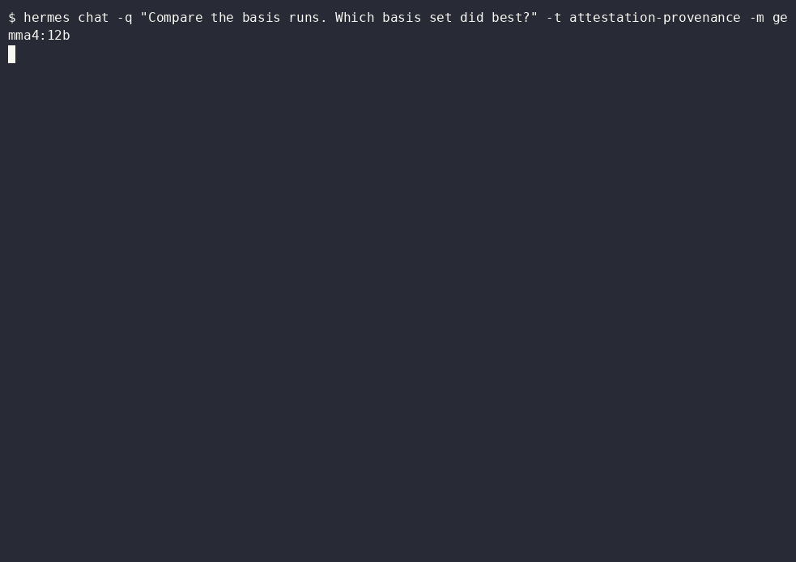

The same for a machine-learning sweep:

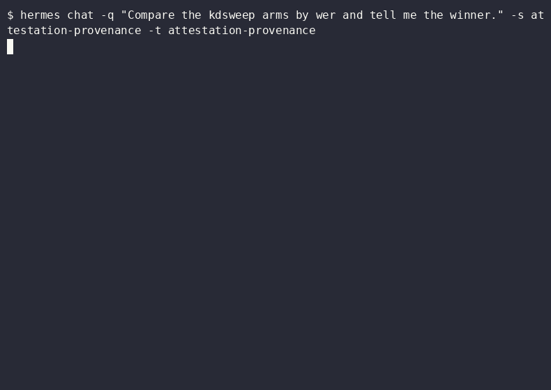

…and a feed question by calling `feed.ask`:

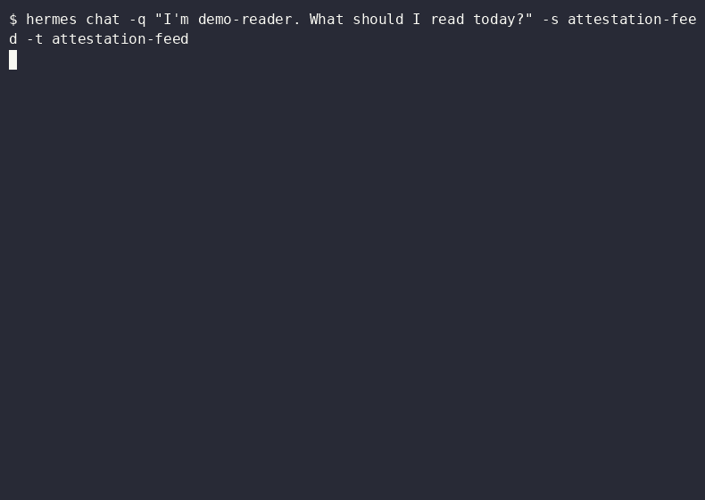

Acting on one item: the agent lists the reader's papers, then calls `feed.ask`
again with that item's `item_id` and `question="useful"`, which records the
judgement the ranker trains on. On gemma4:e2b the reply lists the papers
without saying it rated one; the second call in the trace is the rating.

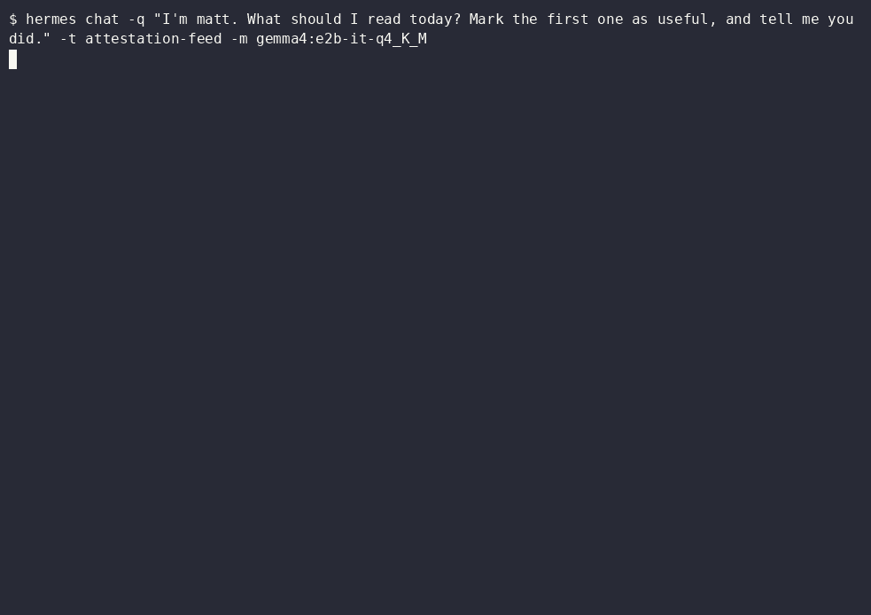

The reading graph through `kg.ask` ("What are the main areas I read about?"),
and exact calculus through `sym.ask` (recorded on gemma4:12b; on gemma4:e2b
the model printed the call as text instead of making it):

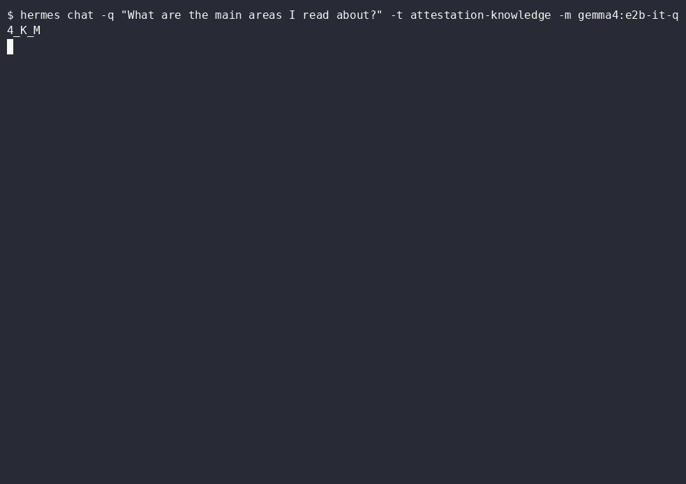

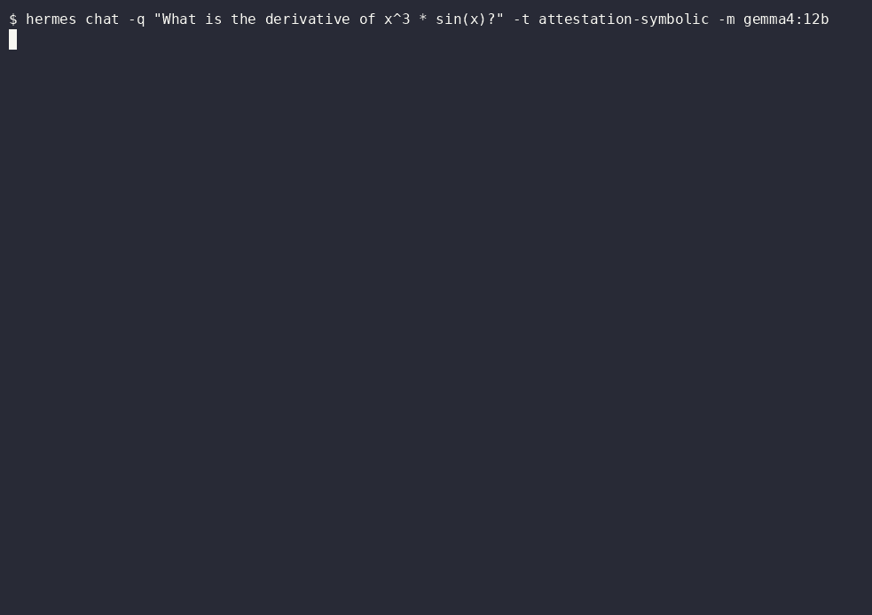

## What each one shows

| directory | shows | needs |
|---|---|---|
| `ledger/` | `attest runs scan`/`list`/`compare` and `attest claims` over `examples/workspace/` | nothing — pure local computation |
| `claims/` | `attest claims` plus `cite.*` over MCP, over `examples/citations/` | nothing — pure local computation |
| `kg-symbolic/` | `kg.*` and `sym.*` over MCP — neither has a CLI command or web page | a model server, once, to seed real tags |
| `feed/` | the HTMX web UI: a ranked feed, marking items useful, the onboarding form | a model server, to seed tagged items |
| `science/` | ledger and claims over a catalyst screen and a basis-set study, with citation keys | nothing — pure local computation |
| `record/` | `attest runs record --scan` writing notebook results and comparing them | nothing — pure local computation |
| `film/` | the narrated film: every clip stitched with a local Piper voiceover | ffmpeg and a Piper voice |
| `library/` | `attest library sync/search/related/export` over `examples/molecular-ai/` | nothing — pure local computation |
| `research/` | `attest research` against PubMed and CrossRef, then tracking the topic | network |
| `hermes/` | a real agent calling `runs.ask`, `feed.ask` (listing and rating), `kg.ask` and `sym.ask` over MCP | a live Hermes install and a model server |

Unlike `examples/*/`, these are not golden paths. They produce video rather
than a pinned output line, and most need a model, so
`tests/test_golden_paths.py` does not run them — which is also why they are
verified by hand rather than by CI.

## Running one

The two model-free demos need no setup:

```bash
bash demos/ledger/narrate.sh examples/workspace
bash demos/claims/narrate.sh examples/citations
```

`narrate.sh` is the inner script — it echoes and runs each command in turn.
`record.sh` wraps it in `asciinema` and converts the result with `agg`:

```bash
uv tool install asciinema
cargo install --locked --git https://github.com/asciinema/agg
bash demos/ledger/record.sh
```

The graph and feed demos need a seeded database first, because a graph built
from the offline stub's placeholder tags has nodes named `existing` and
`title` — not worth recording:

```bash
uv run python demos/kg-symbolic/seed_kg_db.py /tmp/demo.db   # needs a model
ATTEST_DB=/tmp/demo.db bash demos/kg-symbolic/record.sh
```

## Two things that look like bugs and are not

**`demos/kg-symbolic/demo.py` reads its database from `ATTEST_DB`, never from
a positional argument.** A path passed as an argument is silently ignored and
the demo runs against whatever `resolve_db_path` finds. Against a large real
database, `kg.communities` returns an alphabetical sprawl rather than the four
coherent clusters the seeded fixture gives — which reads as a clustering
defect and is an invocation mistake.

**The MCP server's INFO logs go to stderr.** Running `demo.py` by hand looks
noisy for that reason; `record.sh` already redirects them, so the recording
itself is clean.

## Output

Each `record.sh` / `record.py` writes to the repo-root `demo/` directory,
already gitignored, unless given a path as its first argument —
`feed/record.py` always writes `demo/feed.webm` and ignores that argument.
`demos/**/*.cast`, `*.gif`, `*.webm` and `*.db` are gitignored too, so a
recording made in place is never committed by accident.

## Last verified

The original six ran green on 2026-09-22 against `main`. `record/`,
`library/`, the three new agent turns and the two AgentMarkit videos were
recorded on 2026-09-28 against attestation 0.2.2. `research/` was recorded
after #25: its first run turned up CrossRef hits dated 2115 and PubMed hits
carrying a cited paper's DOI, both fixed before it was shown.
`demos/README.md` carries the per-demo evidence.
